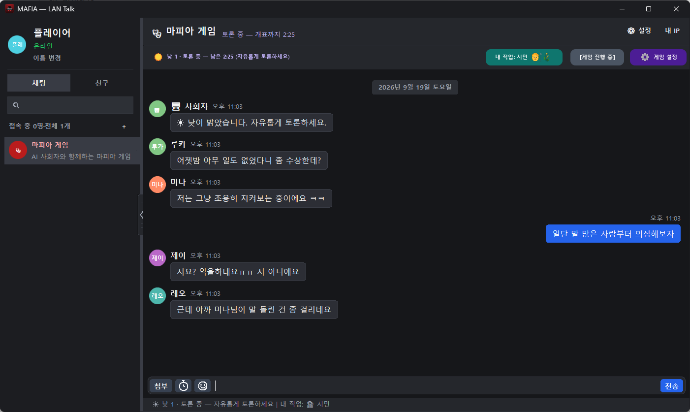
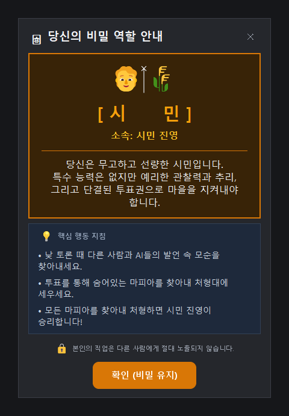
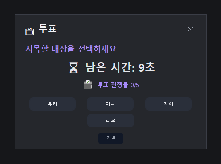
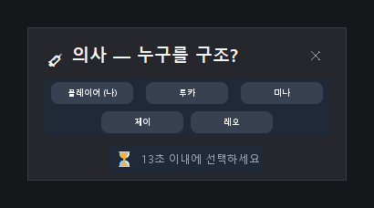
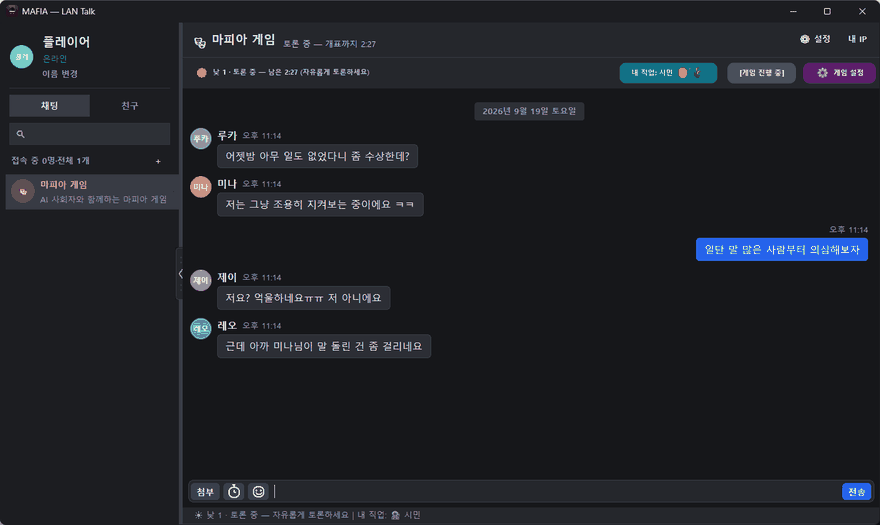
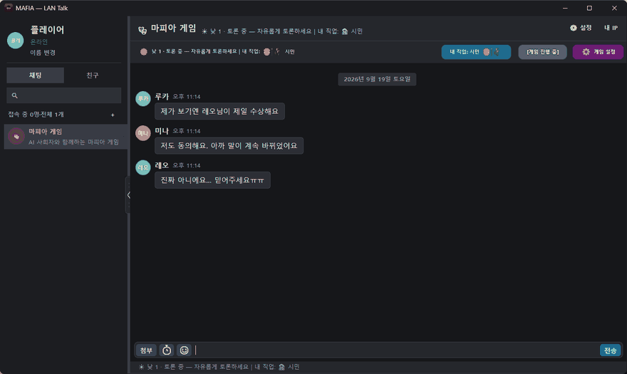
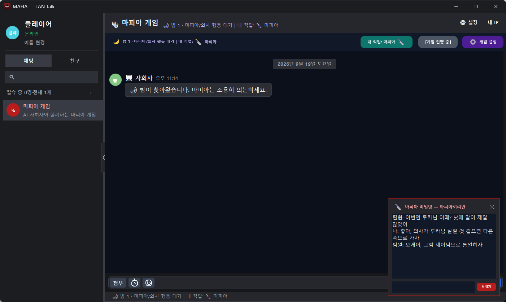

# MAFIA — LAN Talk 기반 마피아 게임

> **이 프로젝트는 [LAN Talk(랜톡)](https://github.com/kururu-SW-DEV/LAN-Talk-serverfree-P2P-LAN-messenger) v6.49를 기반으로 만든 확장판입니다.**
> 서버 없는 P2P LAN 메신저인 랜톡의 네트워크·채팅 UI 위에 **마피아 게임방**을 통합했습니다. 메신저 기능(1:1·그룹 채팅, 파일 전송, 암호화 등)은 랜톡 그대로 쓸 수 있고, 그 위에 AI 참가자가 함께하는 마피아 게임이 추가되어 있습니다.

## 마피아 게임 기능

- **AI 참가자 + 복수 인간 플레이**: 사람 1명 + AI로도, 같은 LAN의 사람 2명 이상 + AI로도 진행할 수 있습니다. 게임 진행은 방장(호스트)이 권위를 갖고, 다른 참가자는 발언·투표·밤 행동을 호스트에게 보냅니다.
- **게임 진행**: 참가자 모집 → 직업 배정(마피아·의사·경찰·시민) → 낮 토론 → 투표(동률 시 재투표) → 최후 변론·찬반 투표 → 밤 행동 → 승패 판정. 투표와 밤 행동에는 제한 시간이 있습니다.
- **직업 구성**: 5~10명(최소 5명, 모자라면 AI가 채웁니다) 모두 의사 1·경찰 1을 포함하고, 마피아는 5~6명 1명 / 7~10명 2명입니다. 의사는 자기 자신도 보호할 수 있지만 같은 사람을 연속으로 보호할 수 없습니다.
- **마피아 공모**: 마피아는 밤에 자동으로 열리는 **마피아 전용 비밀방**에서 의논합니다. 사람 마피아끼리는 물론 **AI 마피아와도 대화**할 수 있고(AI가 먼저 후보를 제안하기도 함), 대화에서 정한 살해 대상(“○○ 노리자”, AI 제안에 “좋아”)이 실제 살해 합의에 반영됩니다. 밤 패널에서 직접 고른 대상이 있으면 그것이 우선합니다.
- **유령방**: 죽은 참가자는 유령 채팅방에서 사망한 AI와 대화할 수 있습니다(원격 참가자 포함).
- **밤 행동 AI**: AI 경찰·의사·마피아도 밤 행동(조사·보호·살해 대상)을 LLM이 판단합니다(답이 늦거나 LLM이 없으면 무작위로 대신해 밤이 멈추지 않습니다). AI 의사는 마피아가 누군지 모른 채 고릅니다.
- **네트워크 보안**: 방장 전용 패킷(게임 종료·역할 통보 등)은 방장이 보낸 것만, 투표·밤 행동은 본인 이름으로 보낸 것만 받습니다. 투표 진행 알림에는 누구에게 투표했는지가 실리지 않습니다(화면뿐 아니라 패킷도 익명).
- **연출**: 사회자 멘트, 밤/낮·재판·처형 시네마틱 배너와 효과음, 컬러 이모지, 둥근 알약형 버튼 UI.
- **접속 끊김 처리**: 게임 중 끊긴 참가자는 사망 처리되어 게임이 멈추지 않습니다.

## 스크린샷

**낮 토론** — AI 참가자와 사람이 한 채팅방에서 토론합니다. 상단 바에서 내 직업 확인, 게임 진행 상태, 설정에 접근합니다.



| 직업 배정 | 투표 | 밤 행동(의사) |
|:---:|:---:|:---:|
|  |  |  |

**시네마틱 연출** — 밤이 찾아오고 아침이 밝는 전환, 재판 개시와 처형 확정 순간에 연출 배너와 효과음이 나옵니다.

| 밤 → 아침 | 재판 → 처형 |
|:---:|:---:|
|  |  |

**마피아 비밀방** — 사람 마피아가 둘 이상이면 밤에 마피아끼리만 보이는 비밀방이 화면 우하단에 자동으로 열립니다. 공개 채팅과는 완전히 분리되어 있습니다.



> 위 화면과 영상은 AI 응답을 임시 가짜 응답으로 대체한 상태에서 캡처한 예시입니다(효과음은 포함되지 않습니다).

### 실행

`START_MAFIA.bat`을 더블클릭하거나 `python lan_messenger.py`로 실행한 뒤, 좌측 목록에서 마피아 게임방을 엽니다. 방장이 **[참가자 모집]** → 참가자가 **[참가 신청]** → 방장이 **[게임 시작]**을 누릅니다.

### AI 참가자 설정 (LLM)

AI 참가자의 발언은 OpenAI 호환 LLM 서버를 호출합니다. 서버 주소·모델·API 키는 게임방의 **게임 설정**에서 입력하거나 환경변수로 지정합니다.

| 환경변수 | 내용 |
|---|---|
| `MAFIA_LLM_BASE_URL` | LLM 서버 주소 |
| `MAFIA_LLM_MODEL` | 모델 이름 |
| `MAFIA_LLM_API_KEY` | API 키 |

설정에 입력한 API 키는 실행 폴더의 `data/mafia_llm.json`에 저장되며 저장소에는 포함되지 않습니다(`.gitignore`).

**Gemini(구글 재미나이) 연결 예** — 코드 수정 없이 게임 설정의 AI API 카드에 입력합니다.

| 항목 | 값 |
|---|---|
| 서버 URL | `https://generativelanguage.googleapis.com/v1beta/openai/chat/completions` |
| 모델명 | 예: `gemini-3.6-flash` (모델명은 시기에 따라 바뀌니 [AI Studio](https://aistudio.google.com/)에서 확인. 종료된 모델은 404) |
| API Key | AI Studio에서 발급한 키 |

- Gemini 주소에는 답이 잘리거나 비는 것을 줄이기 위해 `reasoning_effort=low`를 자동으로 붙이고, 응답이 토큰 한도로 잘리면 한도를 늘려 한 번 더 요청합니다.
- 연결이 안 되면 `data/debug.log`의 `mafia_llm_call` 줄에 원인(모델명·키·URL)이 남습니다.

### 추가 요구 사항

랜톡은 표준 라이브러리만으로 동작하지만, 마피아 확장판의 **컬러 이모지·알약 버튼 렌더링에는 [Pillow](https://python-pillow.org/)와 Windows의 `Segoe UI Emoji` 글꼴이 필요**합니다(`pip install Pillow`, 저장소의 `vendor/`에는 Python 3.14용 사전 빌드본이 동봉되어 있습니다).

### 마피아 확장에서 추가된 파일

| 파일 | 역할 |
|---|---|
| `mafia_core.py` | 게임 규칙·상태머신·투표 집계·승패 판정 (GUI/네트워크 의존 없음) |
| `mafia_ui.py` | 게임방 UI 믹스인(로비·게임 시작/종료) — 아래 `mafia_ui_*` 믹스인을 합친 `MafiaUIMixin` |
| `mafia_ui_common.py` | `mafia_ui_*`가 함께 쓰는 import·상수·헬퍼 |
| `mafia_ui_view.py` | 화면·연출·말풍선 |
| `mafia_ui_net.py` | `[MAFIA1]` 송수신·송신자 검증·호스트↔클라이언트 동기화·접속 끊김 감시 |
| `mafia_ui_secret.py` | 마피아 비밀방·유령방·AI와의 대화·대화로 정하는 살해 목표 |
| `mafia_ui_night.py` | 밤 흐름·AI 밤 행동(LLM 판단) |
| `mafia_ui_vote.py` | 낮 타이머·투표·재투표·최후 변론·처형 |
| `mafia_ui_ai.py` | 사용자 발언 처리·AI 반응·멘션 답변 |
| `mafia_net.py` | `[MAFIA1]` JSON 프로토콜(랜톡 DM에 실어 전송) |
| `mafia_ai.py` | AI 참가자(인격·LLM 호출·발화 관리) |
| `mafia_config.py` | 게임 규칙 상수, 인격 목록, LLM 설정 |
| `emoji_render.py` | 컬러 이모지·알약 버튼 렌더링 |
| `sounds/` | 연출 효과음 |
| `tests/` | 회귀 테스트 (`python tests/test_multiplayer_sync.py` 등). 같은 폴더에서 동시에 두 개를 돌리면 포트가 겹쳐 실패하고, 한글 콘솔 오류는 `PYTHONIOENCODING=utf-8`로 피합니다 |

---

# LAN Talk(랜톡)

> 아래는 기반이 된 LAN Talk의 원본 설명입니다.

서버 없이 동작하는 **P2P LAN 메신저**입니다. 같은 네트워크(사내망, 집, 학교 등)에 있는 사람들끼리 별도 서버·계정·인터넷 연결 없이 1:1 및 그룹 채팅을 할 수 있습니다. Python 표준 라이브러리만으로 동작하며, Windows용 데스크톱 앱(Tkinter GUI)입니다.

---

## 주요 기능

- **서버 없는 P2P 통신**: UDP 브로드캐스트(기본 포트 `50707`, 3초 간격)로 같은 서브넷의 상대를 자동 발견하고, 다른 네트워크 대역의 상대는 IP를 직접 등록해 연결합니다. 포트는 앱 안 `[＋] → 포트 번호 변경`에서 직접 바꿀 수 있습니다(재시작 후 적용).
- **암호화**: 패킷은 HMAC 인증을 거쳐 암호화 전송되며, 로컬에 저장되는 대화 로그도 암호화됩니다.
- **신뢰성 있는 전송**: 수신 확인(ACK) + 유실 시 최대 3회 자동 재전송.
- **1:1 · 그룹 채팅**: 그룹은 별도 서버 없이 각 멤버에게 개별 유니캐스트로 전파(gossip fan-out)하는 방식으로 동작합니다.
- **자동 폭파 메시지**: 1:1·그룹 모두 타이머를 설정해 일정 시간 후 메시지가 자동으로 사라지게 할 수 있습니다.
- **파일 전송**: 드래그 앤 드롭으로 전송, 이어받기(재개) 지원. 최대 크기는 기본 1024MB(1GB)이며 설정에서 1MB~1GB까지 조절 가능합니다(단, 받는 쪽 설정도 그 크기 이상이어야 전달됩니다). 실행 파일(`.exe`, `.bat`, `.ps1` 등)을 받으면 실행 전 경고를 거칩니다.
- **스티커 · 이모지**: 코드로 직접 그린 오리지널 스티커와 표준 유니코드 이모지 패널을 채팅창에 내장.
- **답장 · 공지사항 고정 · 대화 내 검색**(Ctrl+F).
- **프로필 아바타**: 사진을 등록하면 원형으로 자동 크롭.
- **읽지 않은 메시지 배지, 트레이 알림 및 깜빡임, 다크 타이틀바**(Windows DWM) 등 데스크톱 메신저에 맞는 UI.
- **여러 명에게 한 번에 보내기(브로드캐스트)** 기능.

---

## 요구 사항

- Windows 10/11
- Python 3.10 이상 (표준 라이브러리만으로 동작 — 별도 패키지 설치 없이 바로 실행 가능)
- (선택) [Pillow](https://python-pillow.org/): `.jpg`/`.jpeg` 이미지 미리보기와 프로필 사진 크롭에 사용됩니다. 설치돼 있지 않아도 앱은 정상 동작하며, 이 경우 jpg는 파일 카드로 표시됩니다.
  ```bash
  pip install Pillow
  ```

---

## 실행 방법

### Windows에서 바로 실행
`START_LAN Talk.bat`을 더블클릭하면 `pythonw`(콘솔 창 없이) 또는 `python`으로 자동 실행됩니다.

### 커맨드라인에서 실행
```bash
python lan_messenger.py
```

지원하는 옵션:
```bash
python lan_messenger.py --name "표시이름" --port 50707 --datadir "저장폴더경로" --peers 192.168.0.10:50707,192.168.0.11:50707
```
- `--name`: 표시 이름 (기본값: Windows 로그인 계정명)
- `--port`: 사용 포트 (기본: 앱의 `[＋] → 포트 번호 변경`으로 저장해둔 값, 없으면 `50707`. 이 옵션을 주면 저장된 값보다 우선함)
- `--datadir`: 설정/대화 기록 저장 폴더 (기본값은 실행 위치 기준 자동 결정)
- `--peers`: 같은 서브넷이 아니어서 자동 발견이 안 되는 상대를 `ip:port` 형식으로 콤마 구분해 미리 등록

### 독립 실행파일(exe)로 빌드

Python이 설치되지 않은 PC에도 배포하려면 [PyInstaller](https://pyinstaller.org/)로
단일 exe 파일을 만들 수 있습니다.

```bash
pip install pyinstaller
pyinstaller --onefile --windowed --name "LAN Talk" --icon=app.ico \
  --add-data "app.ico;." --collect-all PIL --exclude-module numpy \
  --version-file=version_info.txt lan_messenger.py
```

빌드된 `dist/LAN Talk.exe`는 그 자체로 포터블입니다 — 처음 실행하는 폴더에
`secret.key`와 `data/`를 자동으로 만들고, 이후 실행마다 그 자리를 그대로
씁니다.

---

## 구조

`lan_messenger.py`가 실행 진입점이며, 실제 구현은 유지보수를 위해 여러 파일로 분리되어 있습니다.

| 파일 | 역할 |
|---|---|
| `constants.py` | 포트·타이밍·색상·폰트·레이아웃·아이콘 등 전역 상수 |
| `netutils.py` | 시간 포맷, 로컬 IP 캐시, 아바타 이미지 처리 등 순수 헬퍼 |
| `canvas_utils.py` | 둥근 모서리 캔버스 그리기 헬퍼 |
| `crypto_layer.py` | 패킷 암호화·인증(HMAC) 계층 + 로그 파일 암호화 |
| `applog.py` | 예외를 파일로 남기는 디버그 로그 |
| `winapi.py` | Windows 트레이 알림·다크 타이틀바 (ctypes 기반) |
| `engine.py` | 네트워크 계층 (`Engine` 클래스) |
| `widgets.py` | 재사용 커스텀 위젯 (스플리터, 스크롤 버튼, 이모지 피커 등) |
| `dnd_handler.py` | 드래그앤드롭·트레이 알림 클릭 처리 믹스인 |
| `chat_search.py` | 대화방 내 검색(Ctrl+F) 믹스인 |
| `chat_renderer.py` | 채팅 캔버스 렌더링(말풍선·자동 폭파 배지 등) 믹스인 |
| `dialogs.py` | 그룹 관리·설정 등 각종 다이얼로그 믹스인 |
| `toast_popup.py` | 인앱 알림 토스트 팝업(슬라이드 애니메이션) |
| `app.py` | 위 믹스인들을 합친 최종 GUI 클래스(`App`) |

---

## 참고

- 같은 로컬 네트워크(LAN) 안에서 사용하도록 설계되었습니다. 인터넷을 통한 원격 연결은 지원하지 않습니다.
- 현재 Windows 전용입니다(트레이 알림·다크 타이틀바 등이 `ctypes`로 Win32 API를 직접 호출).
- `LAN Talk.exe`에는 [Pillow](https://python-pillow.org/)가 번들되어 있습니다. 라이선스 전문은 [THIRD_PARTY_LICENSES.md](THIRD_PARTY_LICENSES.md) 참고.

---

## 변경 이력

간단한 버전별 변경 이력은 [CHANGELOG.md](CHANGELOG.md) 참고.
